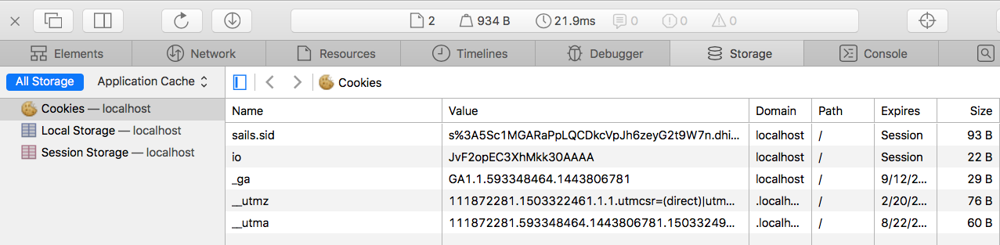

# Real Estate Rental System - M3

a [Sails v1](https://sailsjs.com) application 


### Links

+ [Sails framework documentation](https://sailsjs.com/get-started)
+ [Version notes / upgrading](https://sailsjs.com/documentation/upgrading)
+ [Deployment tips](https://sailsjs.com/documentation/concepts/deployment)
+ [Community support options](https://sailsjs.com/support)
+ [Professional / enterprise options](https://sailsjs.com/enterprise)


### Version info

This app was originally generated on Fri Oct 11 2019 00:36:56 GMT+0800 (Hong Kong Standard Time) using Sails v1.2.3.

### Startup 
Normal way:
```
sudo npm install -g sails
npm install
```
On windows with vscode, add:
```
 set-ExecutionPolicy RemoteSigned
```

```
sails lift
```
### Doing
- Bootstrap template engine 
   -  see layout.ejs file under api/views/layouts.
- Loading initial testing data
  - see bootstrap.js, located under the config folder.
- Routes Setting
  - see routes.js
  - Sample
   ```
    'DELETE /Apartment/:id': 'ApartmentController.delete',
    'GET /Apartment/Update/:id': 'ApartmentController.update',
    'POST /Apartment/Update/:id': 'ApartmentController.update',
    'GET /Apartment/Search/?': 'ApartmentController.search',
    'GET /Apartment/Detail/:id': 'ApartmentController.detail',
    'GET /Apartment/Home/': 'ApartmentController.home',
    'GET /User/Login': 'UserController.login',
    'POST /User/Login': 'UserController.login',
    'POST /User/Logout': 'UserController.logout',

    'GET /Apartment/:id/rentedBy': 'ApartmentController.populate',
    'GET /user/:id/rents': 'UserController.populate',
    'GET /user/:id/rents/add/:fk': 'UserController.add',
    'GET /user/:id/rents/remove/:fk': 'UserController.remove',

    'POST /file/upload/attachment': 'FileController.uploadAttachment'
   ```
- api
  - under ./api 
  - Input Validation - Server-side
  - Redirection
- AJAX 
  - Sample
    ```
        async function submitForm(oFormElement) {
            var response = await fetch(oFormElement.action, {
                method: oFormElement.method,
                credentials: 'same-origin',
                body: new FormData(oFormElement)
            });
            if (response.ok) {
                var data = await response.json();
                alert(data.message);
                window.location = data.url;
            } else if (response.status == 401) {
                var data = await response.text();   // for res.send()
                alert(data);
            } else {
                alert(response.statusText);
            }
        };
    ```
    - Login and Session
      - Under ./api/controller/usercontroller
      - By Postman
    - Encrypting Password
      - with the bcrypt.js library
    - Model Association
    - 
### CRUD
##### Homepage

Page.png)
##### Createpage

##### Searchpage 

##### Updatepage 

##### Detailpage 
Page.png)
##### AdminPage


### What need to do next
- Mobile App with NativeScript-Vue


<!-- Internally, Sails used [`sails-generate@1.16.13`](https://github.com/balderdashy/sails-generate/tree/v1.16.13/lib/core-generators/new). -->


<!--
Note:  Generators are usually run using the globally-installed `sails` CLI (command-line interface).  This CLI version is _environment-specific_ rather than app-specific, thus over time, as a project's dependencies are upgraded or the project is worked on by different developers on different computers using different versions of Node.js, the Sails dependency in its package.json file may differ from the globally-installed Sails CLI release it was originally generated with.  (Be sure to always check out the relevant [upgrading guides](https://sailsjs.com/upgrading) before upgrading the version of Sails used by your app.  If you're stuck, [get help here](https://sailsjs.com/support).)
-->

